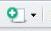

<b><br></b>
<b><br></b>


Pueden descargar este documento en pdf haciendo clic [aquí](https://github.com/Ciespinosa/cargarDatos/blob/master/index.pdf)


#<b>Creando un proyecto en RStudio</b>

---------


__¿Cómo creamos un proyecto?__

A continuación les presentaré una serie de pasos que deben seguir para crear un nuevo proyecto en RStudio.

1. Abrir RStudio
2. Hacer clic en `file` y seleccionar new `Project`
3. En la nueva ventana que se abrió podemos seleccionar de entre tres opciones, puesto que aún no estamos trabajando con versiones de control, por ahora podemos seleccionar entre nuevo directorio `New Directory` o un directorio existente `Existing Directory`.

El nuevo directorio lo que hará es generar una nueva carpeta a partir de la cual vamos a trabajar. Cuando seleccionamos un directorio existente RStudio generará un proyecto dentro de esta carpeta.  Por organización siempre que estoy iniciando un nuevo proyecto prefiero crear un nuevo directorio en el cual colocaré únicamente lo que voy a utilizar en los análisis.

4. Si hemos elegido un directorio existente, la siguiente ventana nos permite decir cuál es la carpeta que quiero enlazar. Hacer clic en `browse`  buscar la carpeta donde colocaré el proyecto y aceptar.

5. Si hemos elegido un directorio nuevo tendremos dos casilleros, el primero indica el nombre que le vamos a poner a la carpeta `Directory Name` y el segundo nos indica donde alojaremos esa carpeta `browse`


##Conozcamos rStudio antes de empezar

<center></center>


Como vemos en la gráfica RStudio está compuesto por cuatro ventanas.  Seguramente en su caso, si acaba de generar el proyecto le aparecerán únicamente tres ventanas. A continuación describiré cada una de las ventanas.

La __primera ventana__ (la que en su caso seguramente no asoma, izquierda superior) lo constituye documentos que pueden ser de varios tipos. El tipo básico es un documento con extensión __.R__ y que nos sirven para ir guardando el código que vamos construyendo para el análisis.  Vamos abrir un script, esto lo podemos hacer de al menos tres maneras, la primera es ir al menú de la consola seleccionar `File > New File > script`, la segunda forma es seleccionar el icono del documento con una cruz verde  y seleccionar `R script`.  La última opción es hacerlo desde el teclado si presionan alt + shift (mayúsculas) y la tecla __N__ obtendrá el mismo resultado.

Existen otros muchos archivos que podemos cargar, pero por ahora este es suficiente.

La __segunda ventana__ (derecha superior), esta ventana se verán todos los objetos que iremos cargando durante el trabajo en RStudio por ahora esta ventana estará vacía.  

>Vamos a generar algunos objetos y ver lo que pasa.

```{r}
nombre<- "Carlos Ivan"
apellido<- "Espinosa Iñiguez"
matriz<- matrix(1:20, 5,4)

```

Ahora podemos ver los objetos creados, algunos salen como valores y la matriz sale como datos.  Los objetos que son datos, puedo abrirlos para ver su estructura.  Si hacen clic en el nombre matriz verán que se abre una nueva hoja en la primera ventana que corresponde a estos datos.

La __tercera columna__ (izquierda abajo), corresponde a la consola de R, esta es la consola donde se ejecutarán todos los códigos y se realizarán los análisis.

La _cuarta columna__ (derecha abajo), en esta ventana tenemos varias pestañas.  La primera `File` nos muestra todos los archivos que están en la carpeta de mi proyecto. La siguiente pestaña `Plots` en esta se verán los gráficos que iré realizando. La pestaña `Help` puede ser usada para pedir ayuda de algún paquete o función que me interese.

Bueno ya conocemos RStudio ahora si a trabajar.


#<b>Leyendo Datos</b>

----------

Vamos a leer unos datos almacenados en formato csv. Existen varias formas para leer datos desde un archivo txt, csv o xls. Empezaremos con los primeros formatos. Antes de nada necesitamos los datos con los que vamos a trabajar los podemos encontrar [aquí](https://github.com/Ciespinosa/cargarDatos/blob/master/AMEBIASIS_LOJA.csv) en formato csv y [aquí](https://github.com/Ciespinosa/cargarDatos/blob/master/AMEBIASIS_LOJA.xlsx) en formato xlsx. Descargamos los archivos y los ponemos en la carpeta del proyecto. Para descargar los archivos csv hacer clic en __RAW__

1. El primer paso es saber si nuestro archivo está en la ubicación del directorio de mi proyecto, para esto utilizaremos la función __dir()__

Teclea en tu consola esta función y mira si tus datos se encuentran ahí?

2. Ahora a cargar los datos usando las funciones read.table() y read_excel()

##Usando read.table

```{r}
ameLoja<-read.table("AMEBIASIS_LOJA.csv", header=TRUE, sep=';')

```

Si en la consola no ha salido ningún error eso quiere decir que los datos han sido cargados correctamente. Antes de continuar supongo que hay algunas dudas con el código que acabamos de subir. 

*¿Que significa header=TRUE?*

Bueno lo que le estamos diciendo es que la primera fila se encuentra los nombres de las variables. 

*Y __sep__?

En este caso, estamos diciendo que la separación entre columnas es una coma.  Al ser formato csv esto es evidente, pero usted podría tener un txt separado por tabulaciones por ejemplo, o por cualquier otro caracter.

##Usando read_excel

```{r}
require(readxl)

read_excel("AMEBIASIS_LOJA.xlsx", 
                      sheet = 1, na = "NA")

```

>¿Qué paso?

La función se ejecutó pero solo se escribió en la consola, claro olvidamos _asignar_ estos datos a un objeto, para _asignar_ usamos  la flecha (__<-__) , esta flecha debe estar precedido por el nombre del  objeto.


```{r}
library(readxl)

ameLojaE<-read_excel("AMEBIASIS_LOJA.xlsx", 
                      sheet = 1, na = "NA")

```

Le he puesto a este objeto al final _E_ para saber que es la tabla que he abierto desde excel, si no ponemos esto el objeto que creamos antes será sobrescrito, y r no nos avisará que se sobrescribe así que hay que tener cuidado.

Cuando leemos desde un archivo excel lo primero que debemos hacer es llamar al paquete que nos permite leer archivos excel ´readxl´ esto lo hacemos con la función _library_ podríamos utilizar también la función _require_.  

Lo siguiente es escribir el nombre del archivo, recuerde que R es sensible a las mayúsculas así que debe poner exactamente como lo muestra el nombre de su archivo.  Posteriormente, le decimos en que hoja se encuentran los datos _sheet_ y que debe poner en las celdas vacías _na_, en este este caso le decimos que ponga "NA" 


## Verificando los datos

Siempre cuando cargo unos datos es necesario asegurarnos que los datos están bien subidos, para esto utilizaremos dos funciones __head__ y __str__

```{r}
head(ameLoja)

```

Como ven esta función lo que hace es mostrarnos los seis primeros datos de cada columna. Esto es muy importante para chequear que no se haya cargado los datos de forma errónea. Ahora veamos lo que hace __str__


```{r}
str(ameLoja)
```

Esta función nos permite saber las características del objeto y luego, de cada una de las variables. Como vemos tenemos diferentes tipos de variables algunas son categóricas y otras numéricas.

Seguramente se estarán preguntando que son estos datos, bueno estos datos corresponden a estadísticas de amebiasis en la provincia de Loja. Vamos a realizar un primer gráfico para conocer como la incidencia de amebiasis se distribuye en los diferentes cantones.

```{r}

table(ameLoja$Cantón)

```

Creo que sería mejor verlo en un gráfico, lo que hacemos es poner plot al principio de la función table.

```{r}
par(mar=c(9,3,2,1))
plot(table(ameLoja$Cantón), las=2, cex.axis=0.8)
```

Como podemos ver en Loja la cantidad de Amebiasis es mucho mayor que en los otros cantones.

> Pero, les parece que esta conclusión de que en el Cantón Loja hay más amebiasis es correcta.

Bueno les dejo con la duda, o mejor con el trabajo.

Ustedes deben trabajar con estos datos y decir si esta conclusión es cierta.

#__Ejercicio 1.__

----------

Seguramente seguirán preguntándose si el gráfico de amebiasis es correcto o no (_eso espero_).

`¿Qué realmente me está diciendo el gráfico?`

Lo que realmente me dice, es la cantidad de amebiasis en cada cantón, no la incidencia de amebiasis.  Vamos a trabajar. Contesten las siguientes preguntas y desarrollen los ejercicios.

1. Busque en internet la definición de incidencia y corrija los datos que hemos obtenido.  Para esto debemos _asignar_ la tabla en un objeto, espero recuerde como hacerlo.

2. Queremos graficar estos resultados, pero que se grafique de una forma ordenada del cantón con menos incidencia al cantón con más incidencia. Para esto utilizaremos la función __order__. Use _?_ o _help()_ para saber cómo puede utilizar la función order.


Con esto hemos terminado el primer ejercicio.  Espero que estén satisfechos ya están trabajando en `r` han aprendido como cargar los datos usando read.table y read_xls, han visto cómo podemos utilizar funciones como; order, head y str, y hemos iniciado a trabajar con gráficas.  En las siguientes lecciones nos adentraremos en funciones que nos servirán para conocer nuestros datos.  
<b><br></b>
<b><br></b>

<center></center>

